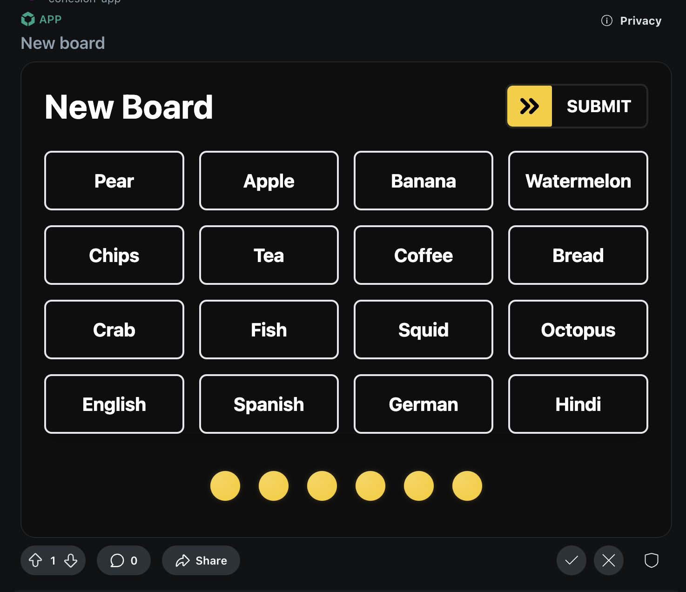
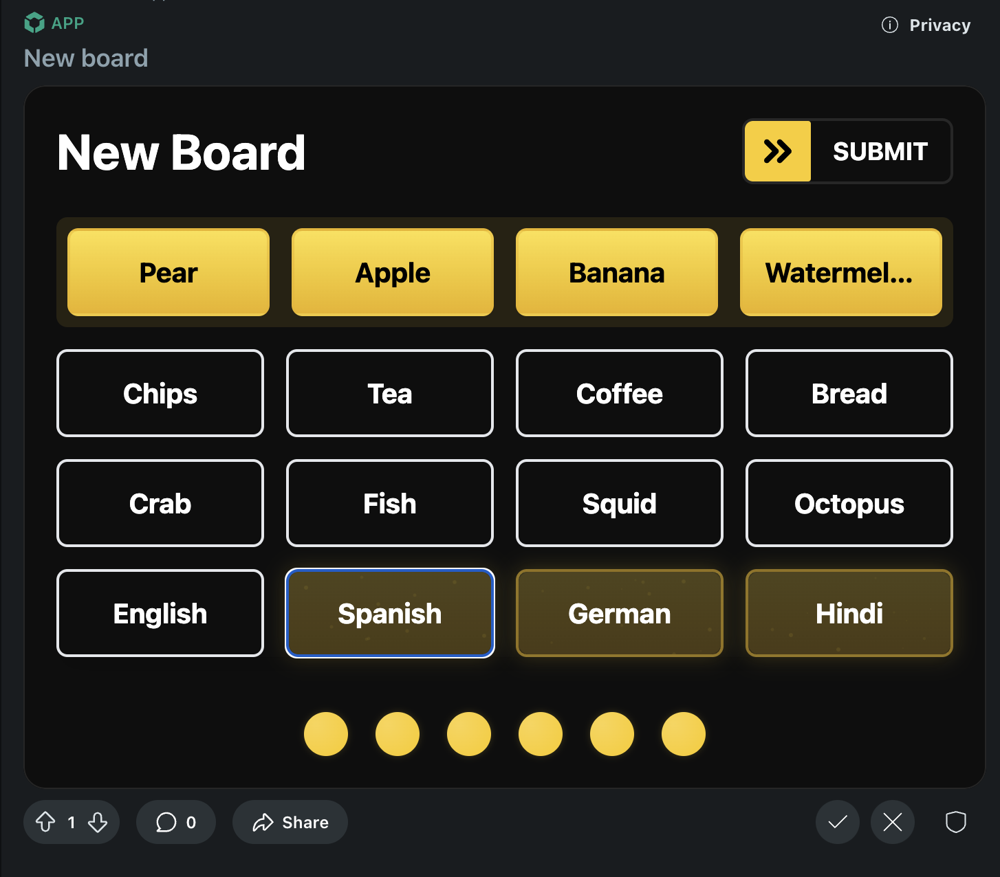

# Cohesion Game

Inspired by the game Connections, Cohesion is a game where players must connect words together using a common word. When you add this application to your subreddit, your community can create their own games and play them together.

You can try out the Game at [https://www.reddit.com/r/devvit_thing/comments/1hg8p2k/new_board/](https://www.reddit.com/r/devvit_thing/comments/1hg8p2k/new_board/)

> Made using Devvit for the [Reddit Hackathon](https://redditgamesandpuzzles.devpost.com/)

Alongside the game, we also launched a website written in SvelteKit to allow users to play the game outside of Reddit. You can find the website [here](https://cohesion-game.vercel.app/).

We are Open Source!!
Find the code for the game [here]()
